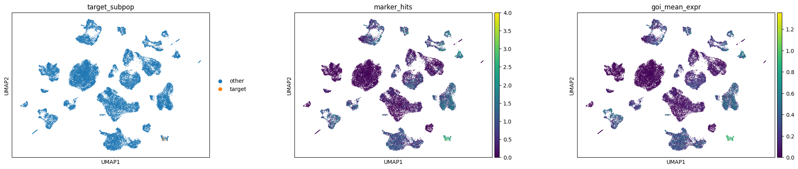
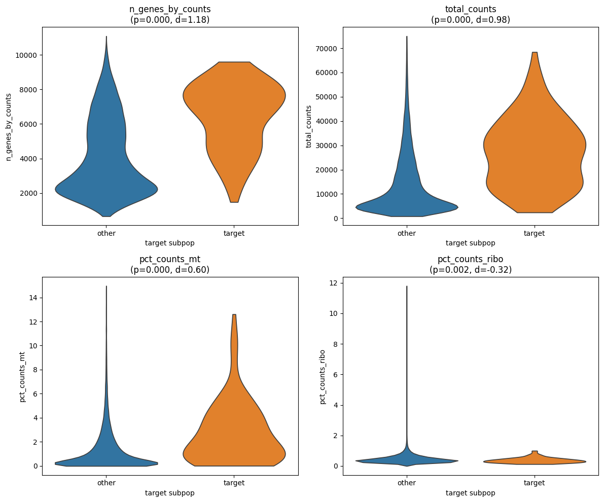
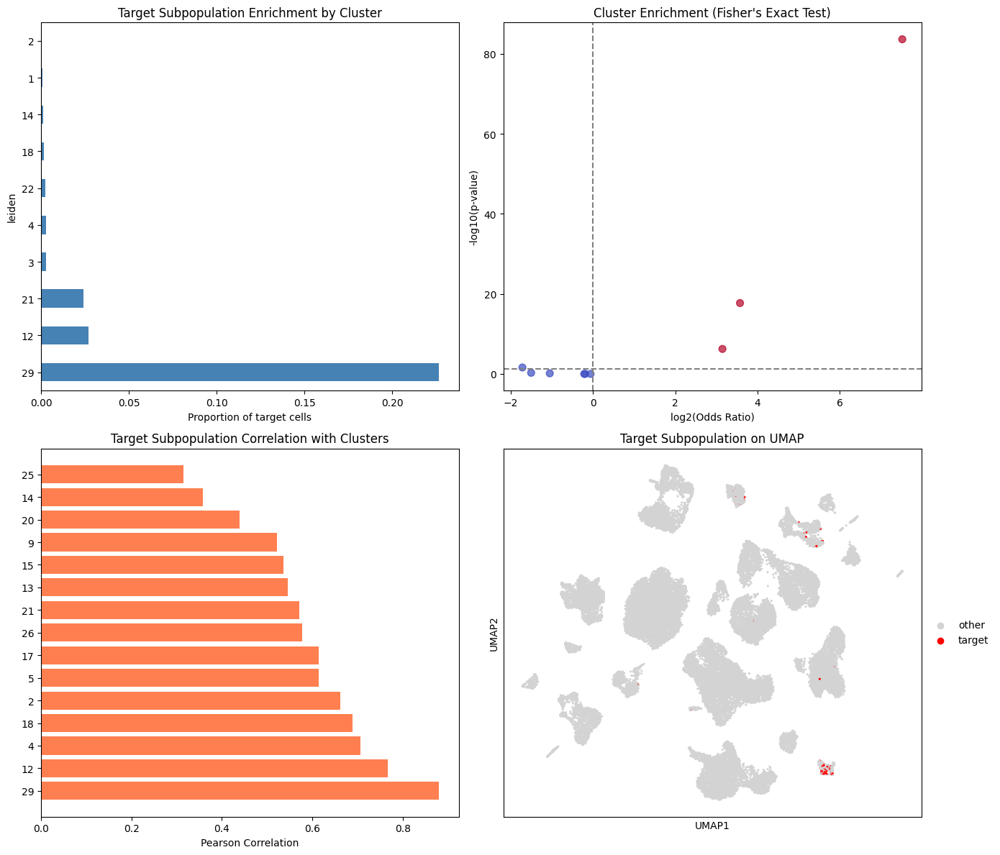
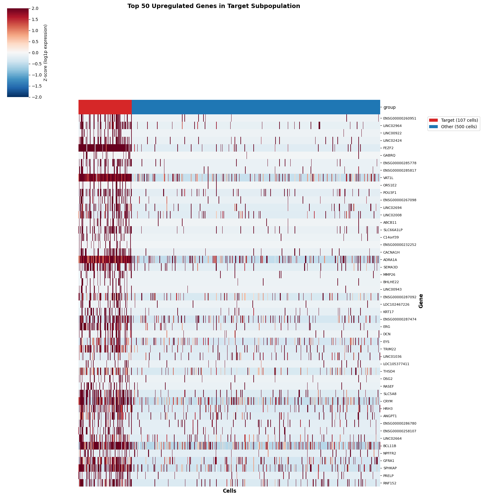

# Single-nucleus RNA Sequencing Analysis

## Project Objectives

This analysis aimed to address two key questions using single-nucleus RNA sequencing data:

### 1. Identify and Characterize Target Subpopulation

**Goal**: Identify the neuronal subpopulation co-expressing four specific marker genes and characterize its properties.

**Target Marker Genes**:
- GABRQ 
- ADRA1A 
- FEZF2 
- VAT1L 

**Characterization metrics**:
- Cell number and proportion
- Correlation with other clusters
- Expression patterns and distribution

### 2. Identify Enriched Genes in Target Subpopulation

**Goal**: Determine which genes are significantly upregulated in the identified subpopulation compared to other cells.

**Method**: Pseudobulk differential expression analysis

---

## Analysis Performed

### Data Processing
- Loaded Seurat object containing 35,309 cells and 36,503 genes
- Converted data from RDS format to Matrix Market format for downstream analysis
- Extracted count matrix, gene annotations, and cell metadata

### Question 1: Subpopulation Identification and Characterization

**Analysis**:
- Identified cells co-expressing GABRQ, ADRA1A, FEZF2, and VAT1L
- Quantified the number and proportion of target cells
- Analyzed expression patterns of marker genes across the dataset
- Assessed correlations between the target subpopulation and other cell clusters

### Question 2: Differential Expression Analysis

**Parameters Used**:
- Minimum expression threshold: **0.5**
- Minimum genes hit: **3**

**Analysis**:
- Performed pseudobulk aggregation for the target subpopulation
- Conducted statistical testing to identify upregulated genes
- Applied multiple testing correction for robust gene identification

**Output Location**: `result/expr0.5_genes3/`

---

## Results

### Question 1: Subpopulation Characteristics

**Key Findings**:
- **Cell Count**: 107 cells identified
- **Proportion**: 0.3% of total dataset
- **Marker Expression**: Co-expression of GABRQ, ADRA1A, FEZF2, and VAT1L defines a distinct subpopulation
- **Spatial Distribution**: Target cells show specific clustering patterns in UMAP space

**Quality Control Comparison**:

- **n_genes_by_counts**: p=6.009533e-26, d=1.18 - Target cells show slightly higher gene detection
- **total_counts**: p=4.344208e-24, d=0.98 - Target cells have higher total UMI counts
- **pct_counts_mt**: p=5.200450e-12, d=0.60 - Moderate difference in mitochondrial content
- **pct_counts_ribo**: p=1.515569e-03, d=-0.32 - Similar ribosomal content between groups

The target subpopulation shows highly significant enrichment in **Cluster 29** (Fisher's Exact Test: p < 1e-80, odds ratio ~84), with ~25% of this cluster consisting of target cells. Correlation analysis reveals that Cluster 29 exhibits the strongest positive correlation (Pearson r ~0.8) with the target subpopulation, followed by Clusters 12, 4, and 18. This indicates that the target cells form a transcriptomically coherent group that is predominantly but not exclusively localized to Cluster 29.

### Question 2: Enriched Genes (expr0.5_genes3)

The volcano plot (left) shows 291 significantly upregulated genes in the target subpopulation. The bar plot (right) compares expression levels (CPM) of the top 20 upregulated genes between target and other cells, with VAT1L and ADRA1A showing the highest expression differences.

**Marker Gene Expression Across All Clusters**:

Dot plot showing the four marker genes (GABRQ, ADRA1A, FEZF2, and VAT1L) across all clusters. Cluster 29 shows the highest mean expression (dark red) and largest fraction of expressing cells (large dots) for all four markers, consistent with the enrichment analysis. Clusters 12, 18, and 21 also show moderate expression, aligning with correlation patterns.

**Top 50 Upregulated Genes Heatmap**:

The heatmap shows z-scored log1p expression of the top 50 upregulated genes across target cells (107 cells, red) versus other cells (500 cells sampled, blue). Clear enrichment patterns demonstrate the molecular distinctiveness of the target subpopulation.
**Top Upregulated Genes**:
- **ENSG00000260951**
- **LINC02964**
- **LINC00922**
- **LINC02424**
- **FEZF2**
- **GABRQ**

**Complete differential expression results**: `result/expr0.5_genes3/pseudobulk_upregulated_genes.csv`

**Complete Results**: See `result/expr0.5_genes3/` directory for:
- Full differential expression table (CSV)
- Additional visualization plots
- Statistical summary files

